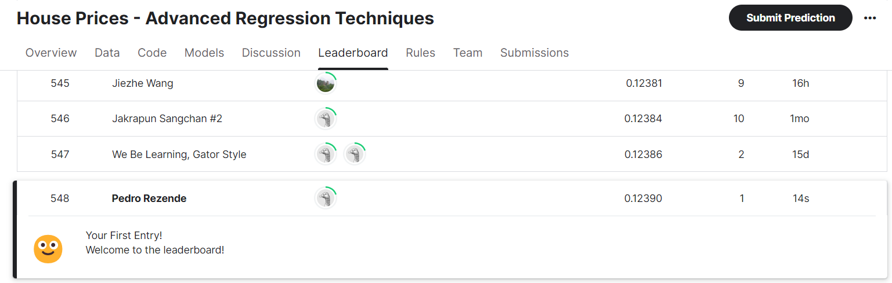

# Atividade sobre notebook Kaggle

### House Prices: Técnicas avançadas de regressão

- Predição de preços de venda e prática de engenharia de recursos, RFs e gradient boosting

### Barema

- Compreensão do desafio House Kaggle, incluindo o contexto e os objetivos do desafio;
- Implementação das soluções do desafio no notebook preparatório de forma que passem nos testes pré-setados;
- Utilização de técnicas, algoritmos e bibliotecas para a resolução dos problemas propostos;
- Submissão das soluções desenvolvidas ao Kaggle Open Challenge;
- Descrição dos requisitos para o desenvolvimento das soluções e compreensão do desafio House Kaggle;
- Explicação detalhada do desenvolvimento das soluções, avaliação, otimização e submissão ao Kaggle utilizando comentários no código.

## Compreensão do desafio House Kaggle

### Contexto e objetivo

O desafio em questão visa prever os preços de venda de casas em Ames, Iowa, utilizando um conjunto de dados que inclui 79 variáveis relacionadas às características das habitações e seus arredores. Essas variáveis abrangem desde aspectos físicos, como tamanho e qualidade da construção, até elementos como localização, proximidade de ferrovias e existência de parques nas proximidades. O objetivo é desenvolver um modelo capaz de estimar os preços de venda com base nessas características, utilizando a métrica de avaliação Root-Mean-Squared-Error (RMSE) entre o logaritmo do preço de venda previsto e observado.

### Descrição dos dados

#### Descrição Geral do Dataset

O conjunto de dados fornecido para este projeto inclui dois arquivos principais: `houses_train_raw.csv` (dados de treino) e `houses_test_raw.csv` (dados de teste).
<br>

- **Estrutura do Conjunto de Dados**

Há um total de 79 variáveis relacionadas às casas, abrangendo diversas características físicas e de localização. As principais variáveis incluem:

- SalePrice: Representa o preço de venda do imóvel e serve como a variável alvo para a modelagem preditiva.

- Características do Imóvel:<br> 
MSSubClass: Classe de construção.<br> 
MSZoning: Classificação de zoneamento.<br> 
LotArea: Tamanho do lote.<br> 
OverallQual: Qualidade geral.<br> 
YearBuilt: Ano de construção.<br> 
ExterQual: Qualidade do material exterior, e muitas outras.<br> 

- Características Internas<br> 
HeatingQC: Qualidade do aquecimento.<br> 
1stFlrSF: Tamanho do primeiro andar.<br> 
FullBath: Número de banheiros completos.<br> 
KitchenQual: Qualidade da cozinha, entre outras.<br> 

- Características Externas<br> 
GarageArea: Área da garagem.<br> 
PoolArea: Área da piscina.<br> 
PoolQC: Qualidade da piscina, e outros.<br> 

Este conjunto de dados oferece uma rica fonte de informações para a construção de modelos preditivos. Os arquivos data_description.txt e sample_submission.csv fornecem descrições detalhadas de cada coluna e um exemplo de submissão, respectivamente.

## Explicação da abordagem utilizada para o treinamento dos modelos

### Diversidade dos Modelos

#### Modelos Individuais:
- **Árvores de Decisão, KNN, Ridge, SVM:** Realizam previsões de forma independente, sem depender de outros modelos.

#### Modelos Ensemble:

- **Random Forest e Boosted Trees:**
  - *Random Forest:* Constrói uma coleção de modelos fracos (Árvores de decisão) sequencialmente, corrigindo os erros do modelo anterior.
  - *Boosted Trees:* Também utiliza árvores de decisão como modelos base, mas enfatiza modelos que corrigem os erros anteriores.

- **Stacking:**
  - Combina previsões de diversos modelos individuais (gboost, adaboost, ridge, svm) para gerar uma previsão final.
  - Os modelos base são treinados individualmente no conjunto de dados completo, e um meta-modelo (como Regressão Linear) é treinado para combinar suas previsões.

- **XGBoost:**
  - Utiliza árvores de decisão como modelos base.
  - Método de boosting, enfocando na correção dos erros anteriores.

### Natureza do Aprendizado

#### Modelos Independentes:
- **Árvores de Decisão, KNN, Ridge, SVM:**
  - Aprendem independentemente do conjunto de dados completo.

#### Modelos Ensemble:

- **Random Forest e Boosted Trees:**
  - Cada modelo base é treinado em uma subamostra aleatória do conjunto de dados (bagging) ou a partir da distribuição de erros do modelo anterior (boosting).

- **Stacking:**
  - Modelos base treinados independentemente no conjunto de dados completo.
  - Um meta-modelo é treinado para combinar suas previsões.

- **XGBoost:**
  - Método de boosting, onde o foco está na correção dos erros.

### Configuração dos Hiperparâmetros

#### Hiperparâmetros Específicos:

- **Árvores de Decisão, KNN, Ridge, SVM:**
  - Cada modelo tem seus próprios hiperparâmetros específicos que precisam ser ajustados.

#### Hiperparâmetros Ensemble:

- **Random Forest e Boosted Trees:**
  - Além dos hiperparâmetros dos modelos base, há hiperparâmetros que controlam a construção do ensemble (número de árvores, taxa de aprendizagem).

- **Stacking:**
  - Cada modelo base tem seus próprios hiperparâmetros.
  - O meta-modelo também pode ter seus próprios hiperparâmetros (por exemplo, pesos atribuídos aos modelos base).

- **XGBoost:**
  - Possui uma variedade de hiperparâmetros ajustáveis, como número de árvores, taxa de aprendizagem e coeficiente de regularização.

### Complexidade de Treinamento

#### Treinamento Rápido:

- **Árvores de Decisão, KNN, Ridge, SVM:**
  - Relativamente simples e rápidos de treinar.

#### Treinamento Mais Lento:

- **Random Forest e Boosted Trees:**
  - Podem ser mais lentos de treinar devido à construção sequencial de vários modelos.

- **Stacking:**
  - Exige o treinamento de vários modelos individuais e, em seguida, o treinamento do meta-modelo, podendo ser o mais lento.

- **XGBoost:**
  - Pode ser mais lento de treinar do que outros métodos de ensemble, pois usa um algoritmo de otimização gradiente.

### Interpretabilidade

#### Modelos Interpretáveis:

- **Árvores de Decisão, KNN, Ridge, SVM:**
  - Fáceis de interpretar individualmente.

#### Modelos Difíceis de Interpretar:

- **Random Forest e Boosted Trees:**
  - Difíceis de interpretar devido à natureza combinada das previsões.

- **Stacking:**
  - A interpretabilidade depende do meta-modelo escolhido.

- **XGBoost:**
  - Difícil de interpretar, pois é um método de boosting.

## Abordagem utilizada para a otimização e melhoria dos modelos

- Aqui será disponibilizado um código base, utilizando programação orientada a objetos, para a otimização dos modelos e implementação dos respectivos modelos. O código base pode ser encontrado logo abaixo.

```python
class DataPreprocessor(BaseEstimator, TransformerMixin):
    def fit(self, X, y=None):
        return self
    
    def transform(self, X):
        # Código para o pré-processamento dos dados
        return X 

class ModelOptimizer:
    def __init__(self, model, param_grid, selector, X, y_log):
        self.model = model
        self.param_grid = param_grid
        self.selector = selector
        self.X = X
        self.y_log = y_log

    def optimize_model(self):
        pipe = Pipeline([
            ('preproc', DataPreprocessor()),
            ('selector', self.selector),
            ('model', self.model)
        ])

        grid_search = GridSearchCV(pipe, self.param_grid, cv=5, scoring='neg_mean_squared_error', verbose=1)
        grid_search.fit(self.X, self.y_log)

        selected_features = self.selector.get_support(indices=True)

        best_model = grid_search.best_estimator_
        score = cross_val_score(best_model, self.X, self.y_log, cv=5, scoring='neg_mean_squared_error')

        print("Melhores parâmetros:", grid_search.best_params_)
        print("Atributos selecionados:", selected_features)
        print("RMSE médio:", abs(score.mean()) ** 0.5)
```

- Dado o código base fornecido, uma abordagem para aprimorar a estrutura seria aplicar a mesma lógica a cada modelo específico. Em outras palavras, é possível utilizar esse padrão de código nos diferentes modelos, como exemplificado abaixo:

```python
from sklearn.tree import DecisionTreeRegressor
from sklearn.feature_selection import SelectKBest

# Suponha que você já tenha X e y_log
model = DecisionTreeRegressor()
param_grid = {'model__max_depth': [10, 20, 30, 40],
              'model__min_samples_leaf': [5, 10, 15, 20]}
selector = SelectKBest()

optimizer = ModelOptimizer(model, param_grid, selector, X, y_log)
optimizer.optimize_model()
```

```python
# Ouro exemplo, só que com o XGBoost
param_grid_xgb = {
    'model__n_estimators': [50, 100, 200],
    'model__learning_rate': [0.01, 0.1, 0.2],
    'model__max_depth': [5, 10, 15]
}
selector_xgb = SelectKBest()

xgb_optimizer = XGBoostOptimizer(param_grid_xgb, selector_xgb, X, y_log)
xgb_optimizer.optimize_model()
```
# Submissão do desafio Kaggle
